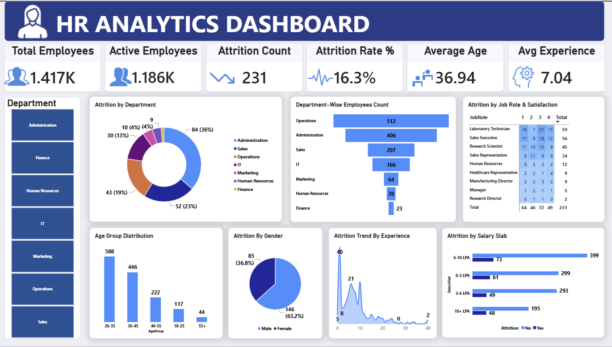

# HR Analytics Dashboard

An interactive **HR Analytics Dashboard built with Power BI** to analyze employee data, workforce trends, attrition patterns, salary distribution, job satisfaction, department performance, gender distribution, age groups, and experience-based attrition.

## 📊 Project Overview

This project transforms raw HR data into an interactive dashboard that helps explore key workforce metrics and identify patterns across different employee segments.

The dashboard provides a centralized view of important HR KPIs and allows users to filter and analyze the data by different employee characteristics.

## 🛠️ Tools & Technologies

* **Power BI**
* **Power Query**
* **DAX**
* **CSV**
* Data Cleaning & Transformation
* Data Visualization

## 📌 Key Analysis Areas

* Total Employees
* Attrition Rate
* Average Salary
* Average Age
* Employee Attrition
* Department Analysis
* Gender Distribution
* Age Group Analysis
* Salary Distribution
* Job Satisfaction
* Experience-based Attrition
* Workforce Trends

## 📈 Dashboard Features

* Interactive KPI cards
* Slicers and filters
* Department-level analysis
* Attrition analysis
* Salary and demographic analysis
* Interactive charts and visualizations
* Clean and user-friendly dashboard layout

## 🔄 Data Preparation

The dataset was imported into Power BI and prepared using **Power Query**, including:

* Data type correction
* Handling missing values
* Removing duplicate records
* Text value standardization
* Data transformation and preparation for analysis

## 🧮 DAX Measures

DAX calculations were used to create analytical metrics such as:

* Total Employees
* Attrition Count
* Attrition Rate %
* Average Salary
* Average Age

## 🖼️ Dashboard Preview

## 📁 Project Files

* `HR_Data.csv` — Source dataset
* `HR_Analytics_Dashboard.pbix` — Power BI dashboard
* `HR_Dashboard.png` — Dashboard preview

## 🎯 Objective

The main objective of this project is to demonstrate practical skills in **data cleaning, data analysis, KPI development, DAX, and Power BI dashboard design** using an HR dataset.
